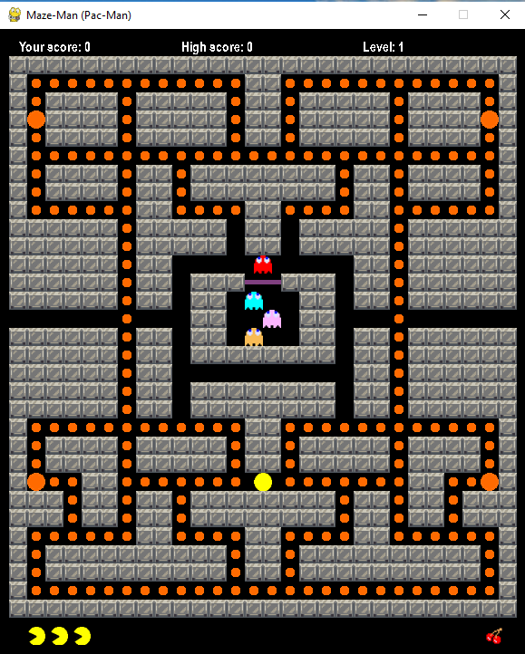
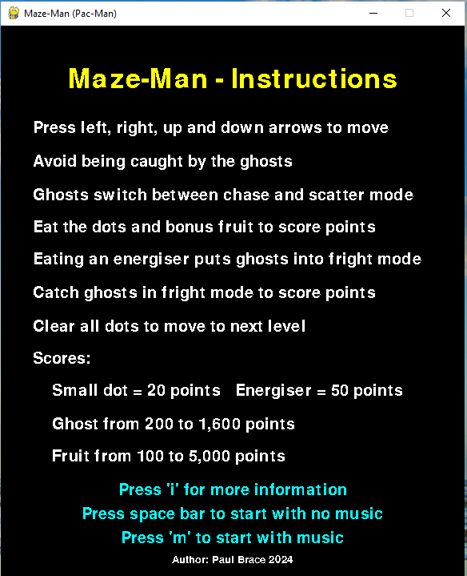
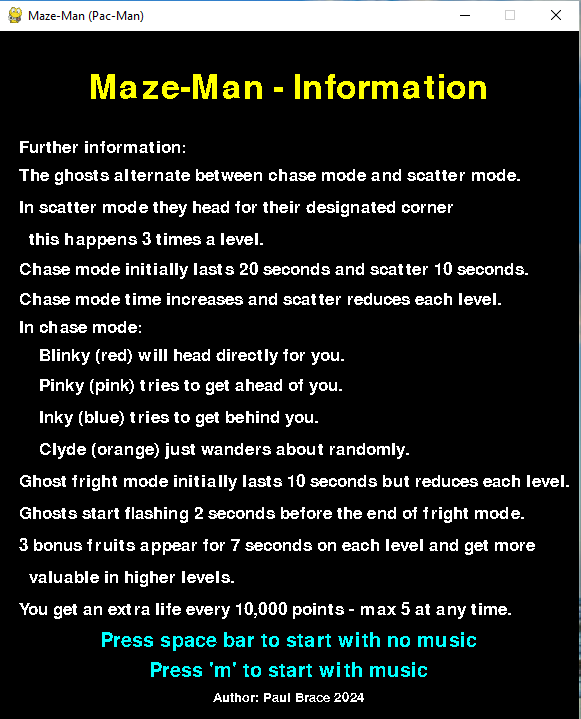

# Maze-Man
 Pac-Man game written in Python using PyGame

I originally wrote this and 3 other retro games in JavaScript for my grandchildren.

If you are interested the site is here http://brace.great-site.net 

I have converted 2 of the other games to Python:

Snake game - https://github.com/paul63/Snake-Game.git

Galaxians type space invaders game - https://github.com/paul63/Alien-Attack.git 

    Author Paul Brace
    paul.brace@gmail.com
    May 2024